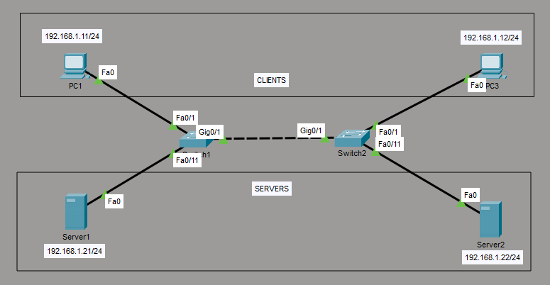

# Lab 03 - VLANs & Trunking

## Ziel
Segmentierung eines Netzwerks mit VLANs sowie Konfiguration von
Access- und Trunk-Ports zur VLAN-übergreifenden Kommunikation auf Layer 2.

## Topologie
  

## VLAN-Design
| VLAN | Name | Zweck |
|------|------------|---------|
| 10 | CLIENTS | PCs |
| 20 | SERVERS | Server |
| 99 | Native | natives VLAN |

## IP-Adressierung
| Gerät | VLAN | IP-Adresse |
|------|------------|---------|
| PC1 | 10 | 192.168.1.11/24 |
| PC2 | 20 | 192.168.1.21/24 |
| PC3 | 10 | 192.168.1.12/24 |
| PC4 | 20 | 192.168.1.22/24 |

## Konfiguration
- VLANs auf Switch1 & Switch2 setzen
- Access Ports VLANs zugeweisen
- Trunk Port zugeweisen und Nativ VLAN setzen

## Verifikation
-  `show vlan brief`
-  `show interfaces trunk`
-  `show mac address-table vlan 10` und für `vlan 20`
- kommunikation innerhalb eines VLANs prüfen mit `ping`
- kein Routing zwischen VLANs prüfen, mit `ping` zu Host im anderen VLAN

## Typische Fehler
- Trunk nicht aktiv
- VLAN fehlt auf einem Switch
- Natives VLAN mismatch
  
## Gelernt
- VLAN-Isolation
- Trunking mit 802.1Q

