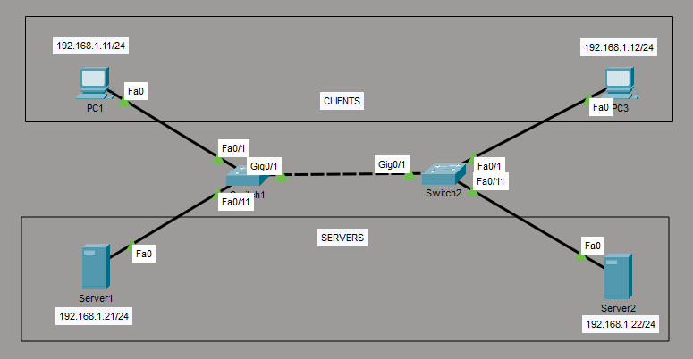

# Lab 03 - VLANs & Trunking

## Ziel
Segmentierung eines Netzwerks mittels VLANs sowie Konfiguration von
Access- und Trunk-Ports zum kontrollierten weiterleiten von VLAN-Traffic
zwischen mehreren Switches.

## Topologie

## VLAN-Design
| VLAN | Name | Zweck |
|------|------------|---------|
| 10 | CLIENTS | PCs |
| 20 | SERVERS | Server |
| 99 | NATIVE | natives VLAN |

## IP-Adressierung
| Gerät | VLAN | IP-Adresse |
|------|------------|---------|
| PC1 | 10 | 192.168.1.11/24 |
| PC2 | 20 | 192.168.1.21/24 |
| PC3 | 10 | 192.168.1.12/24 |
| PC4 | 20 | 192.168.1.22/24 |

## Konfiguration
- VLANs auf beiden Switches erstellt
- Access Ports den entsprechenden VLANs zugewiesen
- Trunk Port konfiguriert
- Native VLAN auf VLAN 99 gesetzt

## Verifikation

### VLAN-Konfiguration
- [`show vlan brief`](screenshots/show-vlan-brief.png)
- [`show interfaces trunk`](screenshots/show-interfaces-trunk.png)

### Connectivity Tests
- kommunikation innerhalb eines VLANs geprüft mit [`ping`](screenshots/pings)
- kein Routing zwischen VLANs geprüft, mit [`ping`](screenshots/pings/ping-vlan20-nach-vlan10.png) zu Host im anderen VLAN

## Typische Fehler
- Trunk nicht aktiv
- VLAN fehlt auf einem Switch
- Natives VLAN mismatch
  
## Gelernt
- VLAN-Isolation
- Trunking mit 802.1Q

