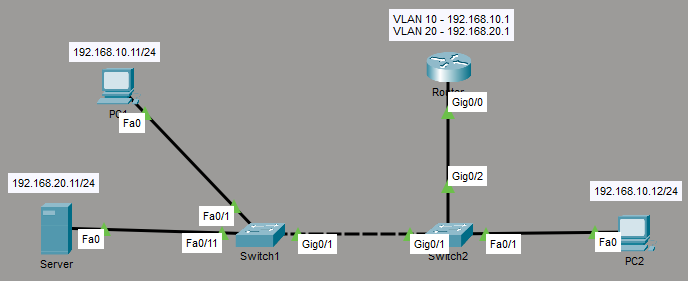

# Lab 04 - Inter-VLAN Routing (Router on a Stick)

## Ziel
Implementierung von Inter-VLAN Routing mittels Router-on-a-Stick,
sum die Kommunikation zwischen VLAN 10 (Clients) und VLAN 20 (Servers)
zu ermöglichen.

## Topologie

## VLAN-Design
| VLAN | Name | Subnetz | Gateway |
|------|-------|---------|---------|
| 10 | CLIENTS | 192.168.10.0/24 | 192.168.10.1 |
| 20 | SERVERS | 192.168.20.0/24 | 192.168.20.1 |

## IP-Adressierung
| Gerät | VLAN | IP-Adresse |
|------|------------|---------|
| PC1 | 10 | 192.168.10.11/24 |
| PC2 | 10 | 192.168.10.12/24 |
| Server | 20 | 192.168.20.11/24 |

## Konfiguration

### Switch
- Trunk-Port zum Router konfiguriert
- VLAN 10 und 20 erlaubt
- Native VLAN 99 gesetzt

### Router
- Subinterfaces für VLAN 10 und 20 erstellt
- 802.1Q Encapsulation aktiviert
- IP-Adressen für Subinterfaces gesetzt

## Verifikation

### Router
- [`show ip interface brief`](screenshots/show-ip-interface-brief.png)
- [`show ip route`](screenshots/show-ip-route.png)

### Switch
- [`show interfaces trunk`](screenshots/show-interfaces-trunk.png)

### Connectivity Test
- `ping` innerhalb von VLAN 10
- `ping` zwischen VLAN 10 und VLAN 20
 
[pings](screenshots/ping-vlan10-and-vlan20.png)

## Typische Fehler
- Subinterface ohne encapsulation dot1Q
- `no shutdown` des Interfaces vergessen
- Default Gateway auf Clients nicht gesetzt
- Trunk-Port nicht aktiv
- VLAN nicht im Trunk erlaubt

## Gelernt
- Router-on-a-Stick Prinzip
- Routing zwischen Broadcast-Domains
- Bedeutung von Default Gateways
- Zusammenspiel von Layer 2 und Layer 3
